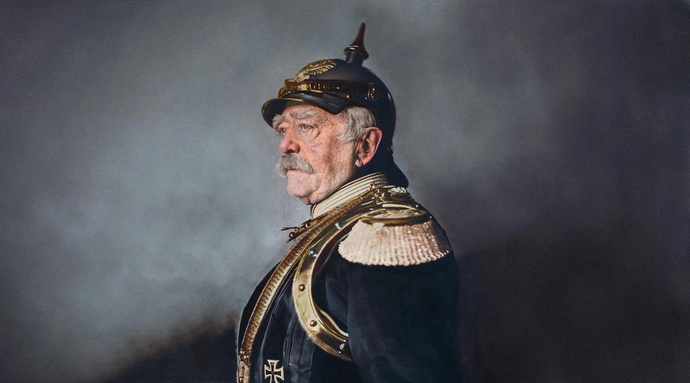

# Bismarck


> Otto von Bismarck unified the German states into a single empire in 1871. This package continues his legacy through the unification of major LLM providers into a single API.

A single unified interface for working with multiple LLM providers. Developers can write their code once and swap models freely.

## Motivation
SDKs, request formats, and output structures vary across LLM providers. Switching between models usually means rewriting integration code. I wanted to remove that friction with one interface that supports switching between any major model.

## Features
* **Provider Agnostic** OpenAI, Anthropic, Google, and others behind a single class.
* **Structured Outputs** Consistent typed response regardless of provider.
* **Model Swapping** Change a single paramter to use a different model.
* **Usage Transparency** Clear usage metrics.

## Example
```
from bismarck import LLM

llm = LLM(model="claude-sonnet-4-6")

response = llm.generate(
    prompt="Where was Teddy Roosevelt born?",
    schema=str
)
```

## Supported Providers
* OpenAI
* Anthropic
* Google

## License
Standard MIT open-source licensing.